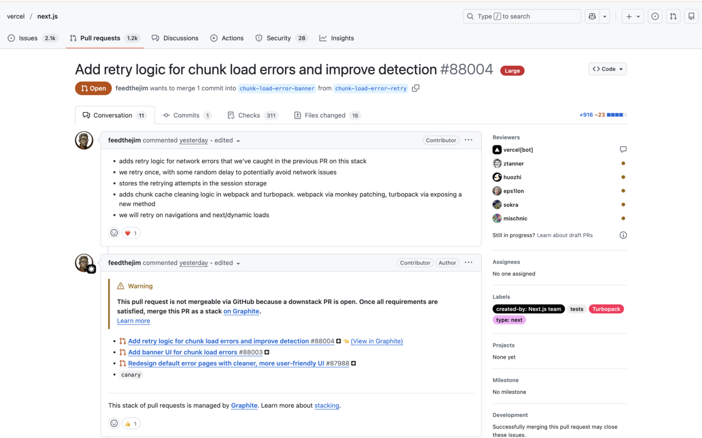

# PR Size Guard

<p align="center">
  
</p>

<p align="center">
  <strong>See GitHub PR size at a glance</strong><br>
  A lightweight Chrome extension that shows Pull Request size badges on GitHub.
</p>

<p align="center">
  <a href="https://github.com/AfraSiyab/pr-size-guard/stargazers"></a>
  <a href="https://github.com/AfraSiyab/pr-size-guard/issues"></a>
  <a href="https://github.com/AfraSiyab/pr-size-guard/blob/main/LICENSE"></a>
  <a href="https://buymeacoffee.com/afrasiyabhaider"></a>
</p>

<p align="center">
  <a href="#-installation">Install</a> •
  <a href="#-features">Features</a> •
  <a href="#%EF%B8%8F-configuration">Configure</a> •
  <a href="#-contributing">Contribute</a>
</p>

---

## 🎯 What It Does

When you open any Pull Request on GitHub, PR Size Guard automatically displays a **color-coded badge** showing the PR size:

| Badge | Category | Meaning |
|-------|----------|---------|
| 🟢 **Small** | ≤5 files, ≤100 lines | Quick review |
| 🟠 **Medium** | ≤15 files, ≤400 lines | Normal review |
| 🔴 **Large** | ≤30 files, ≤1000 lines | Needs focus |
| ⛔ **Critical** | >30 files or >1000 lines | Consider splitting |

<p align="center">
  
</p>

---

## ✨ Features

- **🚀 Instant visibility** — Badge appears directly in the PR header
- **🧠 Smart classification** — Uses the stricter of files vs lines
- **💬 Detailed tooltip** — Hover to see files, additions, and deletions
- **⚙️ Customizable thresholds** — Adjust limits via extension popup
- **🌙 Dark mode support** — Matches GitHub's themes
- **⚡ Lightweight** — No observers, no polling, minimal footprint
- **🔒 Privacy first** — No data collection, no analytics, no network requests

---

## 📦 Installation

### Chrome Web Store
*(Coming soon)*

### Manual Installation (Developer Mode)

1. **Clone or download** this repository:
   ```bash
   git clone https://github.com/AfraSiyab/pr-size-guard.git
   ```

2. Open Chrome and navigate to `chrome://extensions`

3. Enable **Developer mode** (toggle in top right)

4. Click **Load unpacked**

5. Select the `pr-size-guard` folder

6. Navigate to any GitHub Pull Request — the badge will appear!

---

## ⚙️ Configuration

### Default Thresholds

| Size | Max Files | Max Lines |
|------|-----------|-----------|
| Small | ≤ 5 | ≤ 100 |
| Medium | ≤ 15 | ≤ 400 |
| Large | ≤ 30 | ≤ 1000 |
| Critical | > 30 | > 1000 |

### Customize Thresholds

1. Click the **PR Size Guard** icon in your Chrome toolbar
2. Adjust the threshold values for each category
3. Click **Save Settings**

Settings sync across devices if you're signed into Chrome.

---

## 🔒 Privacy

| Check | Status |
|-------|--------|
| Data collection | ❌ None |
| Analytics | ❌ None |
| External requests | ❌ None |
| Tracking | ❌ None |

All processing happens **locally in your browser**. Settings are stored via Chrome's built-in sync storage.

---

## 🛠️ Development

### Project Structure

```
pr-size-guard/
├── manifest.json      # Extension manifest (V3)
├── content.js         # Main content script
├── content.css        # Badge styles
├── popup/
│   ├── popup.html     # Settings UI
│   ├── popup.js       # Settings logic
│   └── popup.css      # Settings styles
└── icons/
    ├── icon-16.png
    ├── icon-48.png
    └── icon-128.png
```

### Local Development

1. Make your changes to the source files
2. Go to `chrome://extensions`
3. Click the refresh icon on PR Size Guard
4. Test on GitHub PR pages

### Testing Checklist

- [ ] Badge appears on PR detail pages
- [ ] Tooltip shows correct stats on hover
- [ ] Settings save and persist
- [ ] Works with GitHub dark mode
- [ ] Works after SPA navigation

---

## 💡 Why PR Size Matters

Studies show code review quality drops significantly after **~400 lines**. Large PRs:

- ⏱️ Take longer to review
- 🐛 Hide bugs more easily
- 😫 Cause reviewer fatigue
- 🚢 Delay shipping

PR Size Guard helps you identify these PRs **before** you start reviewing.

---

## 🤝 Contributing

Contributions are welcome! Here's how you can help:

### Reporting Bugs

Found a bug? Please [open an issue](https://github.com/AfraSiyab/pr-size-guard/issues/new?template=bug_report.md) with:
- Steps to reproduce
- Expected vs actual behavior
- Screenshots if applicable

### Suggesting Features

Have an idea? [Open a feature request](https://github.com/AfraSiyab/pr-size-guard/issues/new?template=feature_request.md)!

### Submitting Code

1. Fork the repository
2. Create a feature branch: `git checkout -b feature/amazing-feature`
3. Make your changes
4. Test thoroughly
5. Commit: `git commit -m 'Add amazing feature'`
6. Push: `git push origin feature/amazing-feature`
7. Open a Pull Request

Please read our [Contributing Guidelines](CONTRIBUTING.md) for more details.

---

## ☕ Support

If this extension helps you, consider supporting development:

<a href="https://buymeacoffee.com/afrasiyabhaider" target="_blank">
  
</a>

---

## 📄 License

This project is licensed under the MIT License — see the [LICENSE](LICENSE) file for details.

---

## 🔗 Links

| Resource | URL |
|----------|-----|
| GitHub | [github.com/AfraSiyab/pr-size-guard](https://github.com/AfraSiyab/pr-size-guard) |
| Issues | [Report a bug](https://github.com/AfraSiyab/pr-size-guard/issues) |
| Support | [Buy Me a Coffee](https://buymeacoffee.com/afrasiyabhaider) |
| Author | [Afrasiyab Haider](https://www.linkedin.com/in/afrasiyab-haider/) |

---

<p align="center">
  Made with ❤️ by <a href="https://www.linkedin.com/in/afrasiyab-haider/">Afrasiyab Haider</a>
</p>

<p align="center">
  <sub>⭐ Star this repo if you find it useful!</sub>
</p>
